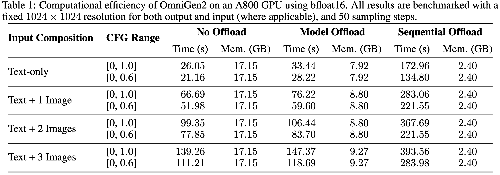

<p align="center">
  
</p>

<p align="center">
  <a href="https://vectorspacelab.github.io/OmniGen2"></a>
  <a href="https://arxiv.org/abs/2506.18871"></a>
  <a href="https://github.com/VectorSpaceLab/OmniGen2?tab=readme-ov-file#-gradio-demo"></a>
  <a href="https://huggingface.co/spaces/OmniGen2/OmniGen2"></a>
  <a href="https://huggingface.co/OmniGen2/OmniGen2"></a>
  <a href=""></a>
  <a href=""></a>
</p>

<h4 align="center">
    <p>
        <a href=#-news>News</a> |
        <a href=#-quick-start>Quick Start</a> |
        <a href=#-usage-tips>Usage Tips</a> |
        <a href=#-limitations>Limitations</a> |
        <a href=#-gradio-demo>Online Demos</a> |
        <a href=#%EF%B8%8F-citing-us>Citation</a>
    <p>
</h4>

## 🔥 News
- **2025-06-24**: [Technical Report](https://arxiv.org/abs/2506.18871) is available.
- **2025-06-23**: We’ve updated our code and HF model—OmniGen2 now runs *without* `flash-attn`. Users can still install it for optimal performance.
- **2025-06-20**: Updated [resource requirements](#-resources-requirement), adding CPU offload support for devices with limited VRAM.
- **2025-06-16**: [Gradio](https://github.com/VectorSpaceLab/OmniGen2?tab=readme-ov-file#-gradio-demo) and [Jupyter](https://github.com/VectorSpaceLab/OmniGen2/blob/main/example.ipynb) is available. Online Gradio Demo: [Demo1](https://8f10329141d53b6884.gradio.live); [Chat-Demo1](https://9315447fc78ef638e3.gradio.live); see more demo links in [gradio section](https://github.com/VectorSpaceLab/OmniGen2?tab=readme-ov-file#-gradio-demo)
- **2025-06-16**: We release **OmniGen2**, a multimodal generation model, model weights can be accessed in [huggingface](https://huggingface.co/OmniGen2/OmniGen2) and [modelscope](https://www.modelscope.cn/models/OmniGen2/OmniGen2).


## Introduction
**OmniGen2** is a powerful and efficient generative model. Unlike OmniGen v1, OmniGen2 features two distinct decoding pathways for text and image modalities, utilizing unshared parameters and a decoupled image tokenizer. OmniGen2 has competitive performance across four primary capabilities:

- **Visual Understanding**: Inherits the robust ability to interpret and analyze image content from its Qwen-VL-2.5 foundation.
- **Text-to-Image Generation**: Creates high-fidelity and aesthetically pleasing images from textual prompts.
- **Instruction-guided Image Editing**: Executes complex, instruction-based image modifications with high precision, achieving state-of-the-art performance among open-source models.
- **In-context Generation**: A versatile capability to process and flexibly combine diverse inputs—including humans, reference objects, and scenes—to produce novel and coherent visual outputs.

As an open-source project, OmniGen2 provides a powerful yet resource-efficient foundation for researchers and developers exploring the frontiers of controllable and personalized generative AI.

**We will release the training code and dataset. Stay tuned!**

<p align="center">
  
  <br>
  <em>Demonstrations.</em>
</p>

<p align="center">
  
  <br>
  <em>Demonstration of OmniGen2's image editing capabilities.</em>
</p>

<p align="center">
  
  <br>
  <em>Demonstration of OmniGen2's in-context generation capabilities.</em>
</p>


## 📌 TODO
- [x] Technical report.
- [ ] In-context generation benchmark: **OmniContext**.
- [x] Support CPU offload and improve inference efficiency.
- [ ] Integrated in diffusers.
- [ ] Training data and scripts.
- [ ] ComfyUI Demo (**commuity support will be greatly appreciated!**).

## 🚀 Quick Start

### 🛠️ Environment Setup

#### ✅ Recommended Setup (Linux/Windows with CUDA)

```bash
# 1. Clone the repo
git clone git@github.com:VectorSpaceLab/OmniGen2.git
cd OmniGen2

# 2. (Optional) Create a clean Python environment
conda create -n omnigen2 python=3.11
conda activate omnigen2

# 3. Install dependencies
# 3.1 Install PyTorch (choose correct CUDA version)
pip install torch==2.6.0 torchvision --extra-index-url https://download.pytorch.org/whl/cu124

# 3.2 Install other required packages
pip install -r requirements.txt

# Note: Version 2.7.4.post1 is specified for compatibility with CUDA 12.4.
# Feel free to use a newer version if you use CUDA 12.6 or they fixed this compatibility issue.
# OmniGen2 runs even without flash-attn, though we recommend install it for best performance.
pip install flash-attn==2.7.4.post1 --no-build-isolation
```

#### 🍎 Apple Silicon (macOS) Setup

**For Apple Silicon Macs (M1/M2/M3/M4), use the optimized fork:**

```bash
# 1. Clone the Apple Silicon optimized repository
git clone https://github.com/zettai-seigi/OmniGen2.git
cd OmniGen2

# 2. Create a clean Python environment
conda create -n omnigen2 python=3.11
conda activate omnigen2

# 3. Install PyTorch with MPS support
pip install torch==2.6.0 torchvision torchaudio

# 4. Install other required packages
pip install -r requirements.txt

# Note: Do NOT install flash-attn on Apple Silicon
```

**📋 See the complete [macOS Setup Guide](README_MACOS.md) for detailed Apple Silicon instructions, optimizations, and troubleshooting.**

#### 🌏 For users in Mainland China

```bash
# Install PyTorch from a domestic mirror
pip install torch==2.6.0 torchvision --index-url https://mirror.sjtu.edu.cn/pytorch-wheels/cu124

# Install other dependencies from Tsinghua mirror
pip install -r requirements.txt -i https://pypi.tuna.tsinghua.edu.cn/simple

# Note: Version 2.7.4.post1 is specified for compatibility with CUDA 12.4.
# Feel free to use a newer version if you use CUDA 12.6 or they fixed this compatibility issue.
# OmniGen2 runs even without flash-attn, though we recommend install it for best performance.
pip install flash-attn==2.7.4.post1 --no-build-isolation -i https://pypi.tuna.tsinghua.edu.cn/simple
```

---

### 🧪 Run Examples

```bash
# Visual Understanding
bash example_understanding.sh

# Text-to-image generation
bash example_t2i.sh

# Instruction-guided image editing
bash example_edit.sh

# In-context generation
bash example_in_context_generation.sh
```

---

### 🌐 Gradio Demo

* **Online Demo**: [HF Spaces](https://huggingface.co/spaces/OmniGen2/OmniGen2). Beyond Hugging Face Spaces, we are *temporarily* allocating additional GPU resources to ensure smooth access to the online demos. If you notice a long queue for a particular link, please try other links:

    [Demo1](https://8f10329141d53b6884.gradio.live), [Demo2](https://110863cb06c6c44bd2.gradio.live), [Demo3](https://19b0952eb3cf0d2243.gradio.live), [Demo4](https://981758b17b4197aea7.gradio.live)

    [Chat-Demo1](https://9315447fc78ef638e3.gradio.live), [Chat-Demo2](https://abe054be89543e4cef.gradio.live), [Chat-Demo3](https://4aa913765db00bbe51.gradio.live), [Chat-Demo4](https://f28a8718565627d2cb.gradio.live)

<!-- [Available on Hugging Face Spaces 🚀](https://huggingface.co/spaces/Shitao/OmniGen2) -->

* **Run Locally**:
    ```bash
    # for only generating image
    pip install gradio
    python app.py
    # Optional: Share demo with public link (You need to be able to access huggingface)
    python app.py --share

    # for generating image or text
    pip install gradio
    python app_chat.py
    
    # 🍎 Apple Silicon users: Enhanced interface available
    python app_chat_enhanced.py  # Modern UI with Apple Silicon optimizations
    ```

## 💡 Usage Tips
To achieve optimal results with OmniGen2, you can adjust the following key hyperparameters based on your specific use case.
- `text_guidance_scale`: Controls how strictly the output adheres to the text prompt (Classifier-Free Guidance).
- `image_guidance_scale`: This controls how much the final image should resemble the input reference image.
    - **The Trade-off**: A higher value makes the output more faithful to the reference image's structure and style, but it might ignore parts of your text prompt. A lower value (~1.5) gives the text prompt more influence.
    - **Tip**: For image editing task, we recommend to set it between 1.2 and 2.0; for in-context generateion task, a higher image_guidance_scale will maintian more details in input images, and we recommend to set it between 2.5 and 3.0.
- `max_pixels`: Automatically resizes images when their total pixel count (width × height) exceeds this limit, while maintaining its aspect ratio. This helps manage performance and memory usage.
  - **Tip**: Default value is 1024*1024. You can reduce this value if you encounter memory issues.
- `max_input_image_side_length`: Maximum side length for input images.
- `negative_prompt`: Tell the model what you don't want to see in the image.
    - **Example**: blurry, low quality, text, watermark
    - **Tip**: For the best results, try experimenting with different negative prompts. If you're not sure, just use the default negative prompt.
- `enable_model_cpu_offload`: **Reduces VRAM usage by nearly 50% with a negligible impact on speed**.
  - This is achieved by offloading the model weights to CPU RAM when they are not in use.
  - See: [Model Offloading](https://huggingface.co/docs/diffusers/optimization/memory#model-offloading)
- `enable_sequential_cpu_offload`: Minimizes VRAM usage to less than 3GB, but at the cost of significantly slower performance.
  - This works by offloading the model in submodules and loading them onto the GPU sequentially as needed.
  - See: [CPU Offloading](https://huggingface.co/docs/diffusers/optimization/memory#cpu-offloading)
- `cfg_range_start`, `cfg_range_end`: Define the timestep range where CFG is applied. Per this [paper](https://arxiv.org/abs/2404.07724), reducing `cfg_range_end` can significantly decrease inference time with a negligible impact on quality.
  
**Some suggestions for improving generation quality:**
1. Use High-Quality Images
  - Provide clear images, preferably with a resolution **greater than 512×512 pixels**.
  - Small or blurry inputs will result in low-quality outputs.
2. Be Specific with Instructions
  - Clearly describe both **what to change** and **how you want it changed**.
  - For in-context generation tasks, explicitly state which elements should come from which image. For example, instead of "Add bird to desk", say "Add the bird from image 1 onto the desk in image 2."
3. Prioritize English
The model currently performs best with **English** prompts.


## ❌ Limitations
The current model sometimes does not follow instructions. You can increase the "Number of images per prompt" to generate multiple images at once, so you can choose the result you are satisfied with, or try different prompts. In our own experience, being as detailed as possible tends to work better.

The current model cannot decide the output image size by itself; the default size is 1024×1024. You need to set a specific size if you require a different one. When you input an image, we will set the output size to match the input image (this works best for editing tasks). If you want to modify just one image out of several, you should also set the output size to match the image you want to edit; otherwise, it may lead to low-quality outputs.

## 💻 Resources Requirement
OmniGen2 natively requires an **NVIDIA RTX 3090** or an equivalent GPU with approximately **17GB of VRAM**. For devices with less VRAM, you can enable **CPU Offload** to run the model.

**Performance Tip**: To improve inference speed, consider decreasing the `cfg_range_end` parameter. Within a reasonable range, this has a negligible impact on output quality.

The following table details the inference performance of OmniGen2 on an **A800 GPU**:
<p align="center">
  
  <br>
  <em>Inference Efficiency of OmniGen2.</em>
</p>

## ❤️ Citing Us
If you find this repository or our work useful, please consider giving a star ⭐ and citation 🦖, which would be greatly appreciated:

```bibtex
@article{wu2025omnigen2,
  title={OmniGen2: Exploration to Advanced Multimodal Generation},
  author={Chenyuan Wu and Pengfei Zheng and Ruiran Yan and Shitao Xiao and Xin Luo and Yueze Wang and Wanli Li and Xiyan Jiang and Yexin Liu and Junjie Zhou and Ze Liu and Ziyi Xia and Chaofan Li and Haoge Deng and Jiahao Wang and Kun Luo and Bo Zhang and Defu Lian and Xinlong Wang and Zhongyuan Wang and Tiejun Huang and Zheng Liu},
  journal={arXiv preprint arXiv:2506.18871},
  year={2025}
}
```
